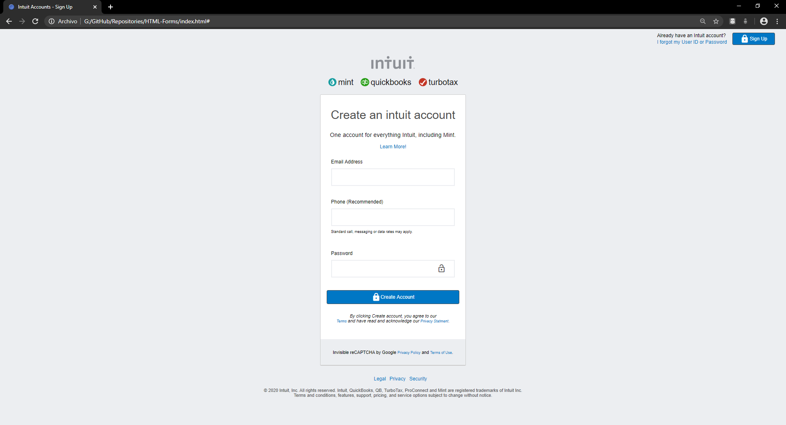

# HTML - Forms

> Replicate the signup webpage of mint.com

This project consists of building an HTML document that matches the appearance of mint.com’s signup page.

## Built With

- HTML.
- CSS.

## Live Demo

[Live Demo Link](https://raw.githack.com/santiagorodriguezbermudez/HTML-Forms/signup-form/index.html)

## Authors

👤 **Gerónimo Morisot**

- Github: [@Bismarck-GM](https://github.com/Bismarck-GM)
- Twitter: [@Rewritablee](https://twitter.com/Rewritablee)
- Linkedin: [geronimomorisot](https://linkedin.com/in/geronimomorisot)

👤 **Santiago Rodriguez**

- Github: [@santiagorodriguezbermudez](https://github.com/santiagorodriguezbermudez)
- Twitter: [@srba87](https://twitter.com/srba87)
- Linkedin: [srba87](https://www.linkedin.com/in/srba87/)

## 🤝 Contributing

Contributions, issues and feature requests are welcome!

Feel free to check the [issues page](issues/).

## Show your support

Give a ⭐️ if you like this project!

## 📝 License

This project is [MIT](lic.url) licensed.